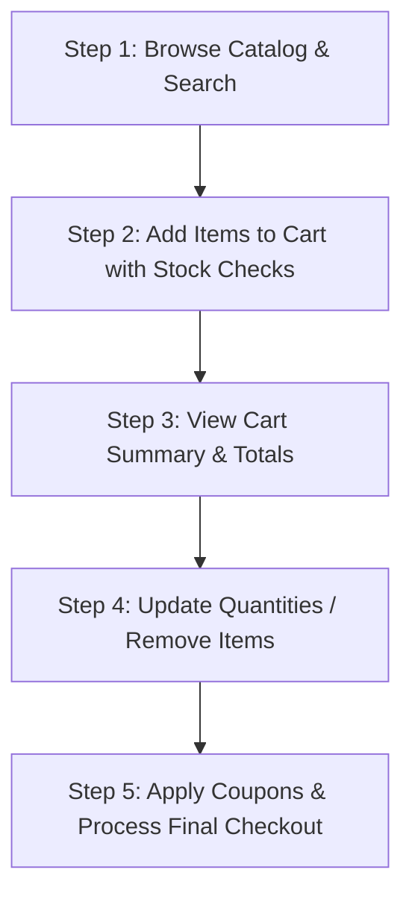

Here is a professional, detailed, and clean `README.md` file designed specifically for your **Week 2 E-Commerce Shopping Cart** simulation. It maps out your dynamic folder structure, details the modular ES6 architecture, explains what each script does, and includes an explanation of the end-to-end user simulation lifecycle.

---

```markdown
# Suntech Assignments - Week 2: Modular E-Commerce Shopping Cart Simulation

Welcome to the documentation for the Week 2 project. This week, we leveled up from simple single-file scripts into building a modular, multi-file **E-Commerce Backend Simulation Engine** using native **ES6 Modules (`import`/`export`)**. 

The architecture isolates concerns across inventory records, shopping cart mutations, complex coupon processing criteria, and transactional checkouts.

---

## 📂 Project Folder Structure

The project is structured modularly to separate business logic and ensure code maintainability:

```text
E-commerce shopping cart/
├── main.js         # Central Controller (Runs the store simulation lifecycle)
├── product.js      # Inventory Data Store & Search/Stock verification engines
├── cart.js         # Mutable Cart System (Add, remove, change quantities)
├── discount.js     # Rule engine for validation & calculations of coupons
└── payment.js      # Checkout coordinator (Deductions, calculations, & fulfillment)

```

---

## 🛠️ Module Breakdowns & Logic Layout

### 1. Catalog & Inventory Controller (`product.js`)

Manages the foundational data array of mock products (including stock levels, item prices, and item categories).

* **Key Mechanisms:** * Uses `.find()` to pinpoint strict matches by `id`.
* Uses `.filter()` paired with `.includes()` to handle dynamic user search terms uniformly by matching lowercased queries.
* Controls warehouse values by updating reference pointers (`stock -= quantity`) safely when checkouts clear.


### 2. Live State Shopping Cart (`cart.js`)

Tracks the active user session data store (`cartItems`).

* **Key Mechanisms:**
* Performs double checking rules (`checkStock`) before accepting additions or adjustments.
* Uses `.find()` to check if a product is already in the cart. If found, it increments the `quantity` instead of creating a duplicate entry.
* Leverages a mathematical `.reduce()` stream to sum up custom subtotal costs:

$$\text{Subtotal} = \sum (\text{item.price} \times \text{item.quantity})$$


### 3. Coupon Validation Engine (`discount.js`)

An independent rules dictionary tracking specific coupon variations (percentage-based deductions vs flat value deductions) along with minimum cart order boundaries.

* **Key Mechanisms:**
* Checks cart total bounds against threshold parameters (`total < c.minAmount`).
* Employs ternary conditional routing to mathematically process percentage value reductions vs strict absolute cash value subtractions.


### 4. Financial Transaction Processor (`payment.js`)

Coordinates the structural bridge across all other active files to execute order fulfillment.

* **Key Mechanisms:**
* Ensures safe execution by preventing checkouts if the cart size is empty.
* Loops over your array using `.forEach()` to deduct items out of the warehouse arrays (`reduceStock`).
* Yields a final order confirmation snapshot object incorporating dynamic IDs (`ORD` + UNIX timestamps) and spreads out finalized item snapshots.
* Completely resets the active session states (`clearCart()`) upon successful generation.


---

## 🔄 The Simulation Flow (`main.js`)

The project's execution logic simulates a complete user checkout lifecycle:



1. **Browsing Catalog & Search:** Loops through available items and simulates looking up the keyword `"phone"`.
2. **Adding to Cart:** Attempts to safely add products. If an item is added multiple times, it updates its quantity.
3. **View Cart:** Prints a structured, formatted table detailing current choices and updates live pricing metrics.
4. **Updating Quantities:** Simulates user changes (e.g., dropping mouse units down or removing an item completely).
5. **Final Checkout:** Registers a final item, runs coupon code `WELCOME10` through validation, calculates the dynamic discount adjustments, updates the stock matrix, and outputs a success invoice receipts schema.

---

## 🚀 How to Run the Project

Ensure you have Node.js installed. Since this system utilizes modern native ES6 modules, make sure you have `"type": "module"` specified in your base `package.json` file.

Run the simulation controller via your terminal prompt:

```bash
node main.js

```

### Example Simulation Output Screen:

```text
E-Commerce Store Simulation 

Step 1: Browsing Catalog 
All Products: 5 items available.
Search "phone": [ { id: 2, name: 'Phone', price: 30000, stock: 15, category: 'electronics' } ]

 Step 2: Adding to Cart 
Item added to cart.

--- Step 3: View Cart ---
┌─────────┬────┬──────────┬───────┬───────┬──────────┬──────────┐
│ (index) │ id │   name   │ price │ stock │ category │ quantity │
├─────────┼────┼──────────┼───────┼───────┼──────────┼──────────┤
│    0    │ 1  │ 'Laptop' │ 50000 │  10   │ 'electr' │    2     │
│    1    │ 4  │ 'Mouse'  │  500  │  50   │ 'access' │    2     │
└─────────┴────┴──────────┴───────┴───────┴──────────┴──────────┘
Current Subtotal: ₹ 101000

--- Step 4: Updating Quantities ---
Quantity updated.
Item removed.

--- Step 5: Final Checkout ---
--- ORDER SUCCESSFUL ---
Order ID: ORD1716300000000
Final Amount Paid: ₹ 72000
Discount Applied: ₹ 8000

```

```
***

*Note: I noticed a minor spelling bug in your code snippets during creation. In `product.js`, `searchProducts` uses `toLocaleLowerCase()` on the product name but calls `.toLowercase()` (with a lowercase 'c') on the query string. In `reduceStock`, the variable is referenced as `qty` instead of `quantity`. These small things will cause a runtime crash if not aligned!*

```
